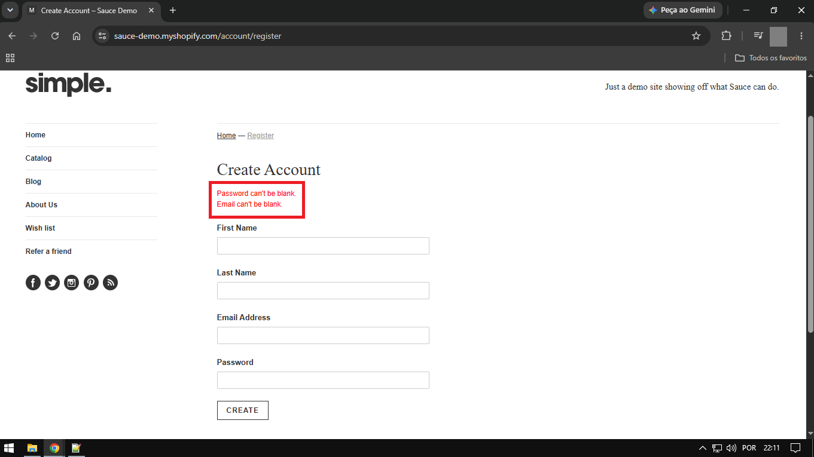

[PT-BR]	BUG - 001 - Mensagens de Erro dos Campos 'First Name' e 'Last Name' Não São Exibidas Quando Todos os Campos Estão Vazios

		Prioridade: Alta
		Severidade: Média
		Status: Aberto
		Tipo: Funcional
		Frequência: 100%
		Ambiente: Web / Desktop - Windows 10
		URL: https://sauce-demo.myshopify.com/account/register
		
		Passos - 
		1. Acessar https://sauce-demo.myshopify.com/
		2. Clicar no botão 'Sign up' localizado no header
		3. Manter campo 'First Name' vazio
		4. Manter campo 'Last Name' vazio
		5. Manter campo 'Email Address' vazio
		6. Manter campo 'Password' vazio
		7. Clicar no botão 'Create'
		
		Resultado esperado - 
			Registro não concluído e exibição de mensagem de erro informando que os campos são obrigatórios:
			"- First name can't be blank.
			 - Last name can't be blank.
			 - Email can't be blank.
			 - Password can't be blank."
		
		Resultado obtido -
			Registro não concluído e foram exibidas apenas as seguintes mensagens de erro:
			"- Email can't be blank.
			 - Password can't be blank."
			 
			As mensagens referentes aos campos 'First Name' e 'Last Name' não são exibidas
			
			
Evidências - 

[Vídeo da Reprodução](./Evidences/ScreenRecording-BUG001.mp4) 
  
		
		
		

[EN-US] BUG - 001 - Missing Error Messages for 'First Name' and 'Last Name' Fields When All Fields Are Empty

		Priority: High
		Severity: Medium
		Status: Open
		Type: Functional
		Frequency: 100%
		Environment: Web / Desktop - Windows 10
		URL: https://sauce-demo.myshopify.com/account/register
	
		Steps - 
		1. Navigate to https://sauce-demo.myshopify.com/
		2. Click on the 'Sign up' button in the header
		3. Keep the 'First Name' field empty
		4. Keep the 'Last Name' field empty
		5. Keep the 'Email Address' field empty
		6. Keep the 'Password' field empty
		7. Click on the 'Create' button
		
		Expected Result - 
			Registration should fail, and the error messages should be displayed:
			"- First name can't be blank.
			 - Last name can't be blank.
			 - Email can't be blank.
			 - Password can't be blank."
			
		Actual Result -
			Registration failed, and only the following error messages were displayed:
			"- Email can't be blank.
			 - Password can't be blank."
			 
			The Messages For the 'First Name' And 'Last Name' Fields are Missing
			
			
Evidences -

[Reproduction Video](./Evidences/ScreenRecording-BUG001.mp4) 
  
